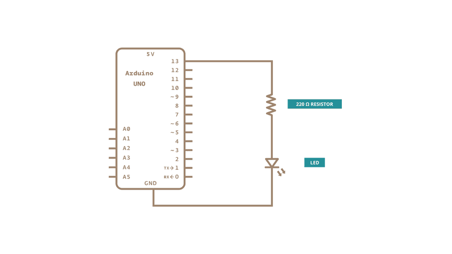

#Blink




```
void setup()
{   
    //initialize digital pin LED_BUILTIN as an output
    pinMode(LED_BUITLIN, OUTPUT);
}

void loop(){
    digitalWrite(LED_BUILTIN, HIGH);
    delay(1000);
    digitalWrite(LED_BUILTIN, LOW);
    delay(1000); //wait for a second
}
```