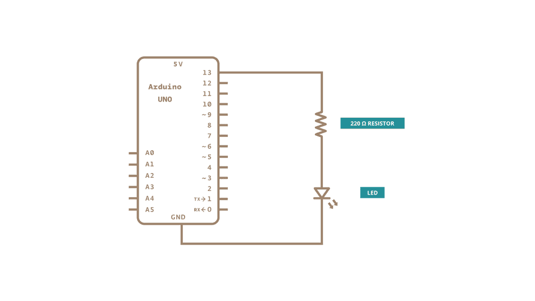

# Blink without delay



```
const int ledPin = LED_BUILTIN;

int ledState = LOW;

//use unsigned long variable to hold time
unsigned long previousMillis = 0;

const long interval = 1000;

void setup()
{
    pinMode(ledPin, OUTPUT);
}

void loop(){
    unsigned long currentMillis = millis();

    if(currentMillis - previousMillis >= interval){
        previousMillis = currentMillis;

        if(ledState == LOW)
        {
            ledState = HIGH;
        }
        else 
        {
            ledState = LOW;
        }
        digitalWrite(ledPin, ledState);
    }
}
```