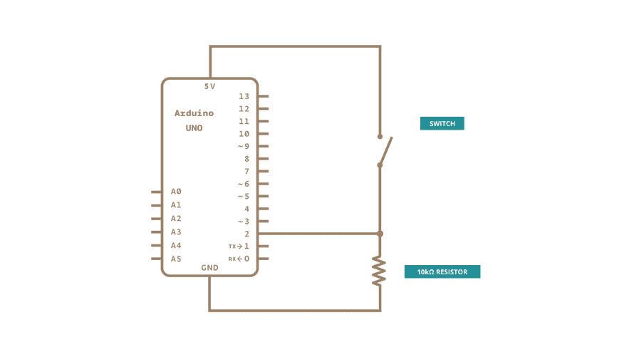

# Debounce on a Pushbutton

>debounce problem: transitions between multiple presses -> fooling the program
>solution: -> checking twice in a short period to validate



```
const int buttonPin = 2;
const int ledPin = 13;

int ledState = HIGH;
int buttonState;
int lastButtonState = LOW;

unsigned long lastDebounceTime = 0;
//last time toggle input pin
unsinged long debounceDelay = 50;
//debounce time -> increase if the output flicker

void setup()
{
    pinMode(buttonPin, INPUT);
    pinMode(ledPin, OUPTUT);

    digitalWrite(ledPin, ledState); //set to high
}

void loop()
{
    int reading = digitalRead(buttonPin);
    //assign digitalvalue of the button -> reading
    if(reading != lastButtonState)
    {
        lastDebounceTime = millis();
    }
    if ((millis() - lastDebounceTime) > debounceDelay)
    {
        if(reading != buttonState)
        {
            buttonState = reading;
            if(buttonState == HIGH)
            {
                ledState != ledState;
            }
        }
    }
    
    digitalWrite(ledPin, ledState);

    lastButtonState = reading;
}
```
