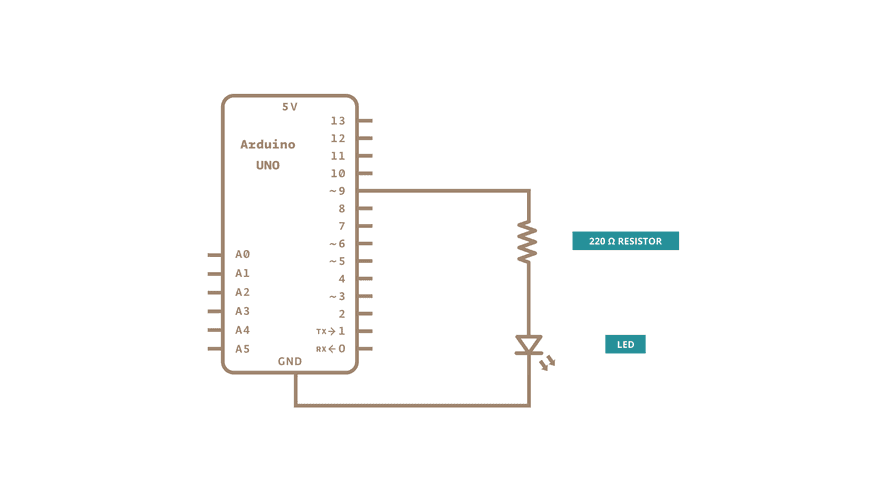

# Fading a LED



```
int led = 9;
int brightness = 0;
int fadeAmount = 5;

void setup(){
    //setup led pin at 9 -> output
    pinMode(led,OUTPUT);

}

void loop(){
    analogWrite(led, brightness);
    brightness = brightness + fadeAmount;

    if(brightness <= 0 || brightness >= 255){
        fadeAmount = -fadeAmount;
    }

    delay(30);
}
```