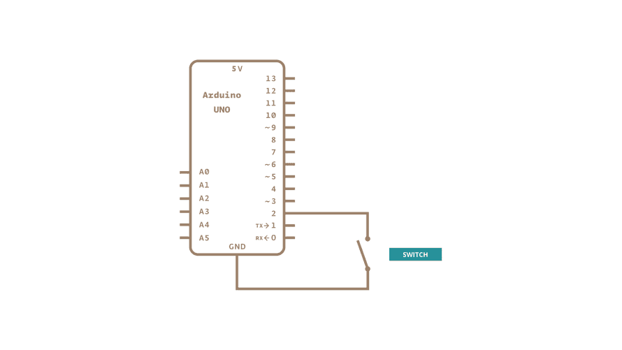

# Inputpullup Serial



```
void setup()
{
    Serial.begin(9600);
    pinMode(2, INPUT_PULLUP);
    pinmode(13, OUPTUT);
}

void loop() {
    int sensorVal = digitalRead(2);
    Serial.println(sensorVal);

    if(sensorVal == HIGH){
        digitalWrite(13, LOW);
    }
    else
    {
        digitalWrite(13, HIGH);
    }
}
```