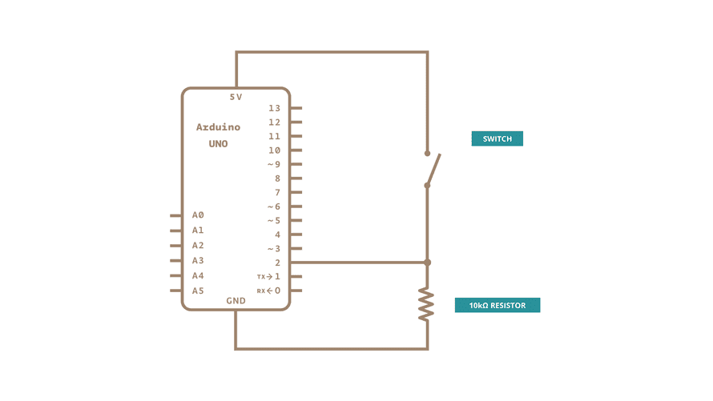

# How to Wire and Program a button



```
const int buttonPin = 2;
const int ledPin = 13;

int buttonState = 0;

void setup(){
    pinMode(ledPin, OUTPUT);
    pinMode(buttonPin, INPUT);
}

void loop(){
    buttonState = digitalRead(buttonPin);
    if (buttonState == HIGH){
        digitalWrite(ledPin, HIGh);
    }
    else
    {
        digitalWrite(ledPin, LOW);
    }
}
```