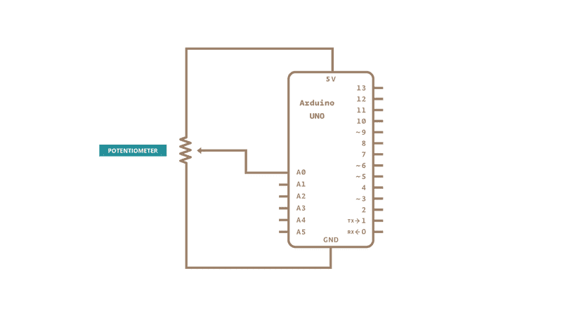

> Serial.begin(9600); -> setup serial communication at 9600 bits of data per seconds



```
void setup()
{
    Serial.begin(9600);

}

void loop()
{
    //read the input on analog pin 0 
    int sensorValue = analogRead(A0);
    Serial.println(serialValue);
    delay(1);
}
```