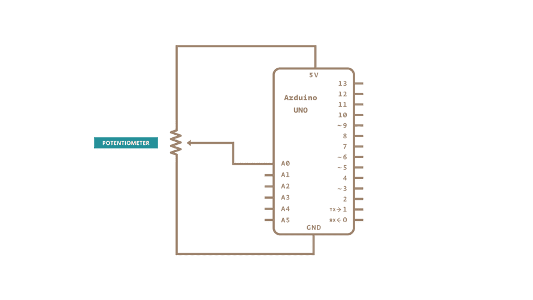

# Read Analog Voltage



```
void setup(){
    Serial.begin(9600);
    
}

void loop(){
    int sensorValue = analogRead(A0);
    //Convert the analogReading 
    float voltage = sensorValue * (5.0/1023);
    //voltage = analogvalue(digitalref/analogref)
    Serial.println(voltage);
}
```